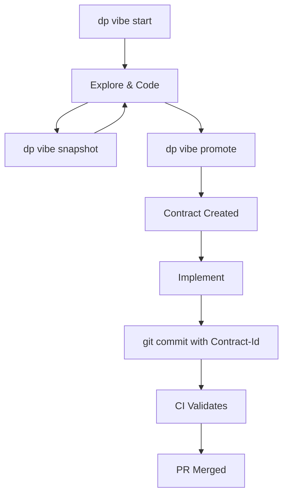

# Contract System Quick Start

Get started with contract-driven development in under 5 minutes!

## 🚀 Installation

```bash
# Clone the repository
git clone https://github.com/your-org/your-repo.git
cd your-repo

# Install dependencies
npm install

# Install pre-commit hooks
npm run hooks:install
```

## 🎯 Choose Your Path

### Path A: "I want to explore first"

Perfect for when you're not sure what you're building yet.

```bash
# 1. Start exploring with vibe
dp vibe start "trying new ideas"

# 2. Code freely (WARN mode active)
vim src/experimental.js
npm test

# 3. Save progress
dp vibe snapshot "this approach works"

# 4. When ready, generate a contract
dp vibe promote

# 5. You now have a formal contract!
ls contracts/F-*.contract.md
```

### Path B: "I know what I'm building"

Great for planned features with clear requirements.

```bash
# 1. Create a contract
cat > contracts/FEAT-001.contract.md << 'EOF'
---
id: FEAT-001
title: My new feature
status: in_progress
owner: me
version: 1.0.0
allowed_globs:
  - src/feature/**
  - tests/feature/**
forbidden_globs:
  - src/core/**
acceptance_criteria:
  - id: AC-1
    must: MUST work correctly
    text: The feature does what it should
    tests:
      - tests/feature.test.js
---
# My Feature
Description here
EOF

# 2. Activate it
echo '{"contract_id":"FEAT-001"}' > .softsensor/active-task.json

# 3. Validate
npm run contracts:validate

# 4. Start coding!
```

## 📝 Essential Commands

### Vibe Commands (Exploration)
```bash
dp vibe start "title"    # Start exploration
dp vibe snapshot "note"  # Save checkpoint  
dp vibe end             # See what you did
dp vibe promote         # Create contract
```

### Contract Commands
```bash
npm run contracts:validate   # Validate all contracts
npm run contracts:enforce    # Check scope locally
npm run hooks:install        # Install pre-commit hook
```

### Mode Control
```bash
echo "WARN" > .softsensor/mode   # Flexible mode
echo "BLOCK" > .softsensor/mode  # Strict mode
# Or use vibe/* branch for auto-WARN
```

## 🔄 The Complete Workflow



## ✅ Commit Format

Always include contract trailers:

```bash
git commit -m "feat: add new feature

Implements the new feature as specified

Contract-Id: FEAT-001
Contract-Hash: abc12345"
```

## 🚦 Understanding Modes

### WARN Mode (Yellow Light)
- Shows warnings but allows commits
- Good for exploration
- Automatic on `vibe/*` branches

### BLOCK Mode (Red Light)
- Blocks commits outside scope
- Enforces contract boundaries
- Default mode for safety

## 🎓 Five-Minute Tutorial

### Minute 1: Setup
```bash
npm install
npm run hooks:install
```

### Minute 2: Start Exploring
```bash
dp vibe start "my first contract"
echo "console.log('hello')" > test.js
```

### Minute 3: Snapshot
```bash
dp vibe snapshot "added test file"
dp vibe end  # See impact
```

### Minute 4: Promote
```bash
dp vibe promote
# Contract generated!
```

### Minute 5: Commit
```bash
git add .
git commit -m "my first contract feature

Contract-Id: F-[generated-id]"
```

## 🆘 Quick Fixes

### "Changes exceed contract scope"
```bash
# Option 1: Check active task
cat .softsensor/active-task.json

# Option 2: Temporary WARN mode
echo "WARN" > .softsensor/mode
```

### "No active task"
```bash
echo '{"contract_id":"YOUR-ID"}' > .softsensor/active-task.json
```

### "Contract validation failed"
```bash
npm run contracts:validate
# Fix errors shown
```

## 📚 Learn More

- **[Full Tutorial](TUTORIAL.md)** - Comprehensive guide
- **[Contract Guide](contracts.md)** - Contract details
- **[Vibe Lane](vibe-lane.md)** - Exploration workflow
- **[Examples](../examples/)** - Sample contracts

## 💡 Pro Tips

1. **Always start with vibe** when unsure
2. **Snapshot often** during exploration
3. **Keep contracts small** and focused
4. **Use descriptive Contract-IDs**
5. **Run validation before committing**

## 🎉 You're Ready!

You now know enough to:
- ✅ Start exploring with vibe
- ✅ Create and validate contracts
- ✅ Commit with proper trailers
- ✅ Switch between modes

**Next step**: Try creating your first contract with `dp vibe start "my feature"`

---

*Questions? Check the [Tutorial](TUTORIAL.md) or [Troubleshooting](TUTORIAL.md#troubleshooting) guide.*