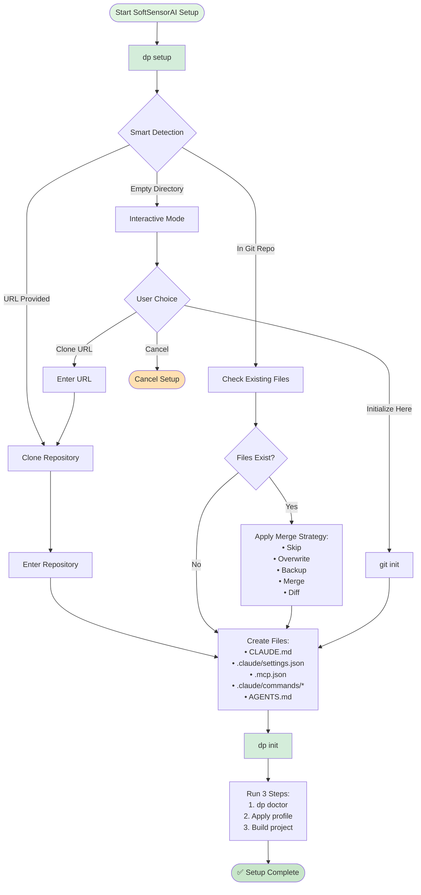

# 📋 SoftSensorAI Setup Workflow Guide

## Overview

SoftSensorAI provides two main paths for setting up AI-assisted development in your repositories:

1. **New Repository** - Clone and configure a fresh repo
2. **Existing Repository** - Add SoftSensorAI to your current project

## 🔄 Setup Workflow Diagram



## 📝 Detailed Workflow Steps

### Path 1: New Repository Setup

```bash
# Setup with URL
dp setup https://github.com/user/repo
```

#### Step-by-Step Process:

1. **🎯 Planning Phase**

   ```
   → Enter repository URL
   → Choose target directory
   → Select branch (optional)
   → Configure options (lite mode, Codex, etc.)
   ```

2. **📥 Clone Repository**

   ```bash
   git clone [--branch BRANCH] URL TARGET
   cd TARGET
   ```

3. **📁 Create SoftSensorAI Configuration**

   ```
   ├── CLAUDE.md           # AI assistant instructions
   ├── AGENTS.md           # Agent documentation
   ├── .claude/
   │   ├── settings.json   # Claude settings
   │   └── commands/       # Command templates
   ├── .mcp.json          # MCP server config
   └── .envrc             # Environment setup (optional)
   ```

4. **🔧 Additional Setup** (unless --lite mode)
   ```
   → Install commit sanitizer hooks
   → Create helper scripts
   → Add Codex integration (if requested)
   ```

### Path 2: Existing Repository Setup

```bash
# Navigate to your repo first
cd /path/to/your/repo

# Run setup - automatically detects existing repo
dp setup
```

#### Step-by-Step Process:

1. **✅ Validation Phase**

   ```
   → Verify current directory is a git repository
   → Detect project type (Node.js, Python, Go, etc.)
   → Check for existing SoftSensorAI files
   ```

2. **🔍 Conflict Detection** For each file to be created:

   ```
   IF file exists:
     → Check for SoftSensorAI markers
     → Determine merge strategy
     → Show diff to user (if needed)
   ELSE:
     → Create new file
   ```

3. **🔀 Merge Strategies**

   | File Type    | Default Strategy | Behavior                                            |
   | ------------ | ---------------- | --------------------------------------------------- |
   | CLAUDE.md    | Merge            | Preserves custom sections, adds SoftSensorAI config |
   | .gitignore   | Merge            | Appends new patterns without duplicates             |
   | package.json | Diff             | Shows changes, prompts user                         |
   | .env         | Skip             | Never overwrites sensitive files                    |
   | .env.example | Backup           | Creates backup before updating                      |

4. **📝 File Creation/Merge** Same files as new repo, but with intelligent handling of existing
   content

## 🎮 Interactive Merge Example

When a file conflict is detected:

```
⚠ File exists: CLAUDE.md

Differences:
--- existing
+++ new
@@ -1,3 +1,5 @@
 # AI Assistant Configuration
+<!-- SoftSensorAI Merged: 2025-09-02 -->
+
 ## Custom Instructions
 [your existing content preserved]
+## SoftSensorAI Configuration
+[new SoftSensorAI standards added]

Options:
  [s] Skip - Keep existing file
  [o] Overwrite - Replace with new file
  [b] Backup & overwrite - Save existing, use new
  [m] Merge - Attempt to merge both files
  [v] View - View both files side by side

Choose action [s/o/b/m/v]: m
✓ Merged CLAUDE.md
```

## 🚀 Quick Start Commands

### For a New Project

```bash
# Interactive mode (recommended)
./setup/repo_wizard.sh

# One-liner with all options
./setup/repo_wizard.sh --url https://github.com/user/repo \
                       --target ~/projects/repo \
                       --branch main \
                       --with-codex
```

### For an Existing Project

```bash
# From within your repository
cd ~/my-existing-project
~/devpilot/setup/existing_repo_setup.sh

# With automatic merge (no prompts)
~/devpilot/setup/existing_repo_setup.sh --auto-merge
```

## 📊 File Creation Order & Priority

```
Priority 1 - Core Configuration:
  1. Create .claude/ directory
  2. Create CLAUDE.md (AI instructions)
  3. Create .claude/settings.json

Priority 2 - Integration:
  4. Create .mcp.json (MCP servers)
  5. Create .claude/commands/* (templates)
  6. Update .gitignore

Priority 3 - Documentation:
  7. Create AGENTS.md
  8. Create/Update README.md sections

Priority 4 - Development Tools:
  9. Create .envrc (if using direnv)
  10. Install commit hooks
  11. Create helper scripts
```

## 🔍 Decision Tree for Setup Method

```
Q: Is this a new project you're starting from scratch?
  → YES: Use repo_wizard.sh with a template repo URL
  → NO: Continue...

Q: Do you have an existing local repository?
  → YES: Use existing_repo_setup.sh from within the repo
  → NO: Continue...

Q: Do you need to clone a remote repository?
  → YES: Use repo_wizard.sh with the repo URL
  → NO: Create a new repo first, then use existing_repo_setup.sh
```

## 💡 Best Practices

### When to Use Each Method

**Use `repo_wizard.sh` when:**

- Starting a new project from a template
- Cloning a team repository for the first time
- You want the full SoftSensorAI setup with all features
- You prefer guided, interactive setup

**Use `existing_repo_setup.sh` when:**

- Adding SoftSensorAI to an established project
- You have custom configurations to preserve
- You want granular control over what gets added
- Migrating from another AI assistant setup

### Handling Sensitive Files

SoftSensorAI NEVER overwrites:

- `.env` files (contains secrets)
- `credentials/*` files
- `secrets/*` directories
- Files with encryption markers

Instead, it:

- Creates `.env.example` templates
- Documents required environment variables
- Provides setup instructions in AGENTS.md

## 🛠️ Customization Options

### Lite Mode (Minimal Setup)

```bash
./setup/repo_wizard.sh --lite
```

Creates only:

- CLAUDE.md
- .claude/settings.json
- .gitignore updates

### Full Mode (Default)

Includes everything:

- All configuration files
- Commit hooks
- Helper scripts
- Codex integration (optional)
- Pre-commit hooks

### Custom Merge Strategies

```bash
# Force overwrite all files
MERGE_STRATEGY=overwrite ./setup/existing_repo_setup.sh

# Always backup existing files
MERGE_STRATEGY=backup ./setup/existing_repo_setup.sh

# Never prompt, always skip existing
MERGE_STRATEGY=skip ./setup/existing_repo_setup.sh
```

## 📈 Post-Setup Verification

After setup completes, verify:

```bash
# Check SoftSensorAI files were created
ls -la CLAUDE.md .claude/ .mcp.json

# Run DPRS to check repository readiness
bash scripts/dprs.sh --output artifacts

# Test AI assistant configuration
# Open the project in Claude or your AI tool
# The CLAUDE.md instructions should be automatically loaded
```

## 🔧 Troubleshooting

### Common Issues

**"Not in a git repo" error:**

```bash
# Initialize git first
git init
# Then run setup
./setup/existing_repo_setup.sh
```

**Permission denied:**

```bash
# Make scripts executable
chmod +x setup/*.sh
```

**Merge conflicts:**

- Choose 'v' to view differences
- Choose 'b' to backup and proceed
- Manually merge if needed

**Missing dependencies:**

```bash
# Install required tools
sudo apt-get install git jq curl
```

## 📚 Further Reading

- [CLAUDE.md Format Guide](./CLAUDE_FORMAT.md)
- [MCP Server Configuration](./MCP_SETUP.md)
- [Commit Hook Documentation](./COMMIT_HOOKS.md)
- [DPRS Improvement Guide](./DPRS_IMPROVEMENT_ROADMAP.md)

---

_Last updated: 2025-09-02 | SoftSensorAI v2.0_
