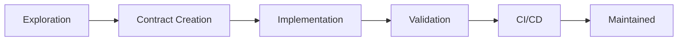

# Contract-Driven Development Tutorial

Welcome to the Contract-Driven Development system! This tutorial will guide you through using contracts to manage your development workflow, from exploration to production.

## Table of Contents
1. [Quick Start](#quick-start)
2. [Core Concepts](#core-concepts)
3. [Your First Contract](#your-first-contract)
4. [Exploration with Vibe Lane](#exploration-with-vibe-lane)
5. [Working with Existing Contracts](#working-with-existing-contracts)
6. [CI/CD Integration](#cicd-integration)
7. [Advanced Features](#advanced-features)
8. [Common Workflows](#common-workflows)
9. [Troubleshooting](#troubleshooting)

## Quick Start

Get up and running in 5 minutes:

```bash
# 1. Install the pre-commit hook
npm run hooks:install

# 2. Start exploring a new feature
dp vibe start "add user authentication"

# 3. Make changes and snapshot progress
vim src/auth.js
dp vibe snapshot "basic auth working"

# 4. Generate a contract from your exploration
dp vibe promote

# 5. Commit with contract trailers
git commit -m "feat: add authentication

Contract-Id: F-M5K9-A2B3
Contract-Hash: abc12345"
```

## Core Concepts

### What is a Contract?

A contract is a markdown file that defines:
- **Scope**: Which files can be modified (allowed_globs)
- **Restrictions**: Which files cannot be touched (forbidden_globs)
- **Requirements**: What must be accomplished (acceptance_criteria)
- **Quality**: Performance and telemetry requirements (budgets)

### Contract Lifecycle



### Key Components

1. **Contracts** - Feature specifications in `contracts/`
2. **Active Task** - Current work context in `.softsensor/active-task.json`
3. **Modes** - WARN (flexible) vs BLOCK (strict)
4. **Vibe Sessions** - Exploration tracking
5. **Contract Hashes** - Change detection

## Your First Contract

### Method 1: Manual Creation

Create `contracts/FEAT-001.contract.md`:

```yaml
---
id: FEAT-001
title: Add user profile page
status: in_progress
owner: yourname
version: 1.0.0
allowed_globs:
  - src/pages/profile/**
  - tests/profile/**
forbidden_globs:
  - src/api/**  # Don't touch the API layer
acceptance_criteria:
  - id: AC-1
    must: MUST display user information
    text: Show username, email, and avatar
    tests:
      - tests/profile/display.test.js
  - id: AC-2
    must: MUST allow profile editing
    text: Users can update their information
    tests:
      - tests/profile/edit.test.js
---

# User Profile Page

This contract implements a user profile page with viewing and editing capabilities.
```

### Method 2: Generate from Template

```bash
# Use the vibe workflow to auto-generate
dp vibe start "user profile page"
# ... make changes ...
dp vibe promote  # Generates contract automatically
```

### Activate the Contract

```bash
# Set as active task
cat > .softsensor/active-task.json << EOF
{
  "contract_id": "FEAT-001",
  "allowed_globs": ["src/pages/profile/**", "tests/profile/**"],
  "forbidden_globs": ["src/api/**"]
}
EOF

# Validate the contract
npm run contracts:validate
```

## Exploration with Vibe Lane

Vibe Lane lets you explore freely before committing to a contract.

### Starting a Vibe Session

```bash
# Start exploring
dp vibe start "experiment with caching"
```

This:
- Creates branch `vibe/experiment-with-caching`
- Sets mode to WARN (non-blocking)
- Initializes session tracking

### Working in Vibe Mode

```bash
# Make changes freely
vim src/cache.js
npm test

# Snapshot important milestones
dp vibe snapshot "Redis integration working"
dp vibe snapshot "Added TTL support"

# See what you've done
dp vibe end
```

Output:
```
📊 Impact Report
   Total files changed: 5
   
📁 Files by directory:
   src/cache/
     - redis.js
     - memory.js
   tests/
     - cache.test.js

💡 Suggested allowed_globs:
   - src/cache/**
   - tests/**
```

### Promoting to Contract

```bash
dp vibe promote
```

This automatically:
1. Generates contract from your changes
2. Creates test scaffolds
3. Updates active task
4. Switches to BLOCK mode

## Working with Existing Contracts

### Finding Contracts

```bash
# List all contracts
ls contracts/*.contract.md

# View contract details
cat contracts/FEAT-001.contract.md

# Check contract status
npm run contracts:validate
```

### Switching Contracts

```bash
# Change active contract
cat > .softsensor/active-task.json << EOF
{
  "contract_id": "FEAT-002"
}
EOF
```

### Checking Scope

```bash
# Before committing, check if files are allowed
git status

# The pre-commit hook will warn/block automatically
git commit -m "test"
# 🔍 Scope Guard (BLOCK mode)
#    Active contract: FEAT-001
# ❌ Out of scope: src/api/users.js
```

## CI/CD Integration

### Pull Request Flow

1. **Create PR with contract declaration**:
```markdown
## Contract Declaration
**Contract-Id(s):** FEAT-001
**Contract-Hash(es):** abc12345

## Acceptance Criteria Mapping
| Criterion | Description | Files |
|-----------|-------------|-------|
| AC-1 | Display user info | src/pages/profile/view.js |
| AC-2 | Edit profile | src/pages/profile/edit.js |
```

2. **CI automatically checks**:
   - Contract validation
   - Scope compliance
   - Touchpoint tests
   - Performance budgets

### GitHub Actions Workflow

The CI runs these checks:

```yaml
# .github/workflows/contract-enforcer.yml
- Validate contracts
- Verify commit trailers
- Check file scope
- Run touchpoint tests
- Check budgets (if defined)
```

## Advanced Features

### Performance Budgets

Add performance constraints to any contract:

```yaml
budgets:
  latency_ms_p50: 200      # 50th percentile < 200ms
  bundle_kb_delta_max: 50   # Bundle increase < 50KB
```

Check locally:
```bash
CONTRACT_IDS="FEAT-001" npm run budgets:check
```

### Telemetry Requirements

Ensure tracking events are implemented:

```yaml
telemetry:
  events:
    - "profile.viewed"
    - "profile.edited"
    - "profile.saved"
```

### Agent Integration

Use AI within contract bounds:

```bash
# Set active task
echo '{"contract_id":"FEAT-001"}' > .softsensor/active-task.json

# Run agent task
npm run agent:task "implement the profile edit form"
# Agent will only modify allowed files
```

### Multi-Contract PRs

Work on multiple contracts simultaneously:

```bash
# Commit with multiple contracts
git commit -m "feat: user profiles and settings

Contract-Id: FEAT-001 FEAT-002
Contract-Hash: abc123 def456"
```

## Common Workflows

### Workflow 1: Feature Development

```bash
# 1. Start with exploration
dp vibe start "new feature"

# 2. Prototype and experiment
# ... make changes ...
dp vibe snapshot "working prototype"

# 3. Formalize into contract
dp vibe promote

# 4. Refine the contract
vim contracts/F-*.contract.md

# 5. Implement properly
# ... structured development ...

# 6. Commit with trailers
git commit -m "feat: implement feature
Contract-Id: F-ABC123"
```

### Workflow 2: Bug Fix

```bash
# 1. Create targeted contract
cat > contracts/BUG-001.contract.md << 'EOF'
---
id: BUG-001
title: Fix authentication timeout
status: in_progress
allowed_globs:
  - src/auth/session.js
  - tests/auth/timeout.test.js
---
EOF

# 2. Activate contract
echo '{"contract_id":"BUG-001"}' > .softsensor/active-task.json

# 3. Fix and test
vim src/auth/session.js
npm test

# 4. Commit
git commit -m "fix: authentication timeout
Contract-Id: BUG-001"
```

### Workflow 3: Refactoring

```bash
# 1. Use vibe for exploration
dp vibe start "refactor data layer"

# 2. Try different approaches
dp vibe snapshot "approach 1: repository pattern"
git stash
dp vibe snapshot "approach 2: active record"

# 3. Choose best approach and promote
dp vibe promote

# 4. Execute refactoring within contract
```

## Troubleshooting

### Issue: "Changes exceed contract scope"

**Solution 1**: Check your active task
```bash
cat .softsensor/active-task.json
# Ensure correct contract_id
```

**Solution 2**: Temporarily switch to WARN mode
```bash
echo "WARN" > .softsensor/mode
# Make your changes
echo "BLOCK" > .softsensor/mode
```

**Solution 3**: Update contract scope
```bash
vim contracts/YOUR-CONTRACT.contract.md
# Add needed paths to allowed_globs
npm run contracts:validate
```

### Issue: "No active task configured"

**Solution**: Create active task file
```bash
cat > .softsensor/active-task.json << EOF
{
  "contract_id": "YOUR-CONTRACT-ID",
  "allowed_globs": [],
  "forbidden_globs": []
}
EOF
```

### Issue: "Contract hash mismatch"

**Solution**: Regenerate hash
```bash
npm run contracts:validate
# Use new hash from .softsensor/CONTRACT-ID.hash
```

### Issue: "Pre-commit hook not running"

**Solution**: Install hooks
```bash
npm run hooks:install
# Verify: ls -la .git/hooks/pre-commit
```

### Issue: "Vibe session already exists"

**Solution**: End current session
```bash
dp vibe end
dp vibe start "new session"
```

## Best Practices

### 1. Start with Vibe
- Use vibe for exploration
- Don't over-plan initially
- Snapshot meaningful progress

### 2. Keep Contracts Focused
- One feature per contract
- Clear acceptance criteria
- Minimal allowed_globs

### 3. Use Descriptive IDs
- Feature contracts: `FEAT-*`
- Bug fixes: `BUG-*`
- Refactoring: `REFACTOR-*`
- Infrastructure: `INFRA-*`

### 4. Test Early
- Write tests with contracts
- Use touchpoint tests
- Run before committing

### 5. Document Intent
- Clear contract titles
- Descriptive criteria
- Helpful commit messages

## Next Steps

1. **Try the Tutorial**: Create your first contract
2. **Explore Vibe**: Start an exploration session
3. **Read the Docs**: 
   - [Contract Guide](contracts.md)
   - [Vibe Lane Guide](vibe-lane.md)
4. **Check Examples**: Browse `contracts/` directory
5. **Get Help**: File issues on GitHub

## Summary

The contract system provides:
- **Structure** without rigidity
- **Exploration** with safety nets
- **Quality** through automation
- **Traceability** from idea to deployment

Start with `dp vibe start` and let the system guide you!