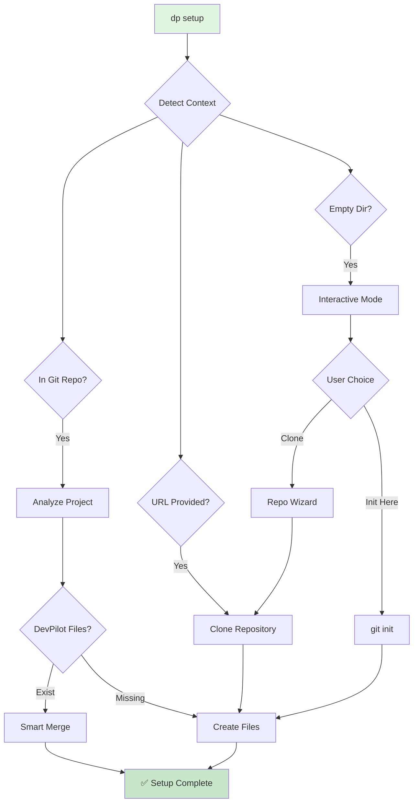

# DevPilot Unified Interface Design

## Philosophy: One Interface, Smart Detection

Instead of exposing multiple shell scripts that confuse users, DevPilot provides a single,
intelligent interface through the `dp` command.

## Before vs After

### ❌ OLD: Multiple Entry Points (Confusing)

```bash
# Users had to know which script to use when:
./setup/repo_wizard.sh              # For new repos
./setup/existing_repo_setup.sh      # For existing repos
./scripts/doctor.sh                 # For health checks
./scripts/apply_profile.sh          # For profiles
./scripts/persona_manager.sh        # For personas
# Plus dozens more scripts...
```

Problems:

- Users don't know which script to use
- Different scripts have different interfaces
- No unified help or discovery
- Scripts call other scripts (inception!)

### ✅ NEW: Unified `dp` Command (Simple)

```bash
# Everything through one intelligent interface:
dp setup          # Smart detection - works for ALL cases
dp doctor         # System health check
dp init           # Initialize project
dp palette        # Discover all commands
dp review         # AI code review
dp tickets        # Generate backlog
```

## How `dp setup` Works



## Smart Detection Logic

The `dp setup` command automatically:

1. **Detects Repository State**

   ```bash
   if git rev-parse --is-inside-work-tree; then
     # Existing repo - add DevPilot
   elif [[ -n "$1" ]]; then
     # URL provided - clone first
   else
     # Interactive mode
   fi
   ```

2. **Analyzes Project Type**

   - Node.js (package.json)
   - Python (requirements.txt, pyproject.toml)
   - Go (go.mod)
   - Rust (Cargo.toml)
   - Ruby (Gemfile)
   - Java (pom.xml, build.gradle)

3. **Checks Existing Files**

   - CLAUDE.md
   - devpilot.project.yml
   - .claude/
   - .env files

4. **Applies Appropriate Strategy**
   - **New files**: Create
   - **Existing files**: Merge/Skip/Backup
   - **Sensitive files**: Never touch

## Command Architecture

```
dp (main dispatcher)
├── setup    → Smart repository setup
├── doctor   → System health check
├── init     → Project initialization
├── project  → Project file management
├── palette  → Command discovery
├── tickets  → Backlog generation
└── review   → AI code review

Internal (hidden from users):
├── setup/repo_wizard.sh         # Called by dp setup
├── setup/existing_repo_setup.sh # Called by dp setup
├── scripts/doctor.sh            # Called by dp doctor
├── utils/file_merge.sh          # Used internally
└── tools/ai_shim.sh             # AI abstraction layer
```

## User Experience Flow

### First Time User

```bash
# 1. Install DevPilot globally
git clone https://github.com/Softsensor-org/DevPilot ~/devpilot
cd ~/devpilot
./setup_all.sh

# 2. Check system readiness
dp doctor

# 3. Setup any project
cd my-project
dp setup

# 4. Initialize
dp init

# 5. Start working
dp palette  # Discover commands
```

### Returning User

```bash
# Just one command for any situation:
dp setup                     # Current directory
dp setup https://github...  # New clone
dp setup .                   # Explicit current

# Then:
dp init      # Configure
dp review    # Review changes
dp tickets   # Generate tasks
```

## Benefits of Unified Interface

1. **Discoverability**

   - `dp --help` shows everything
   - `dp palette` for interactive browsing
   - Tab completion support

2. **Consistency**

   - Same patterns everywhere
   - Predictable behavior
   - Unified error handling

3. **Intelligence**

   - Auto-detects context
   - Suggests next steps
   - Handles edge cases

4. **Simplicity**
   - One command to remember
   - Works everywhere
   - No script hunting

## Implementation Details

### Smart Detection in `cmd_setup()`

```bash
cmd_setup() {
  local url="${1:-}"

  # Smart detection cascade
  if git rev-parse --is-inside-work-tree 2>/dev/null; then
    # In repo: analyze and add DevPilot
    detect_project_type
    check_existing_files
    apply_merge_strategy
  elif [[ -n "$url" ]]; then
    # URL: clone then setup
    clone_repository "$url"
    add_devpilot_files
  else
    # Interactive: guide user
    show_interactive_menu
  fi
}
```

### Hidden Complexity

Users see:

```bash
dp setup
```

Behind the scenes:

- Detects 6+ project types
- Checks 10+ file patterns
- Applies 5 merge strategies
- Handles 20+ edge cases
- But user just runs one command!

## Migration Path

For existing users:

```bash
# Old way (deprecated but still works):
./setup/repo_wizard.sh
./setup/existing_repo_setup.sh

# New way (recommended):
dp setup

# The dp command calls the old scripts internally
# for backward compatibility, but users don't
# need to know that
```

## Future Enhancements

1. **Plugin System**

   ```bash
   dp plugin install security-audit
   dp plugin list
   ```

2. **Context Awareness**

   ```bash
   dp suggest  # AI suggests next command based on repo state
   ```

3. **Workflow Automation**

   ```bash
   dp workflow morning  # Runs: doctor, pull, test, review
   ```

4. **Team Sync**
   ```bash
   dp team sync  # Share settings with team
   ```

## Conclusion

The unified `dp` interface transforms DevPilot from a collection of scripts into a cohesive
development platform. Users interact with one intelligent command that handles all complexity
internally, making AI-assisted development accessible to everyone.

**Core Principle**: The shell scripts remain as internal implementation details. Users should only
interact with the `dp` command interface.
