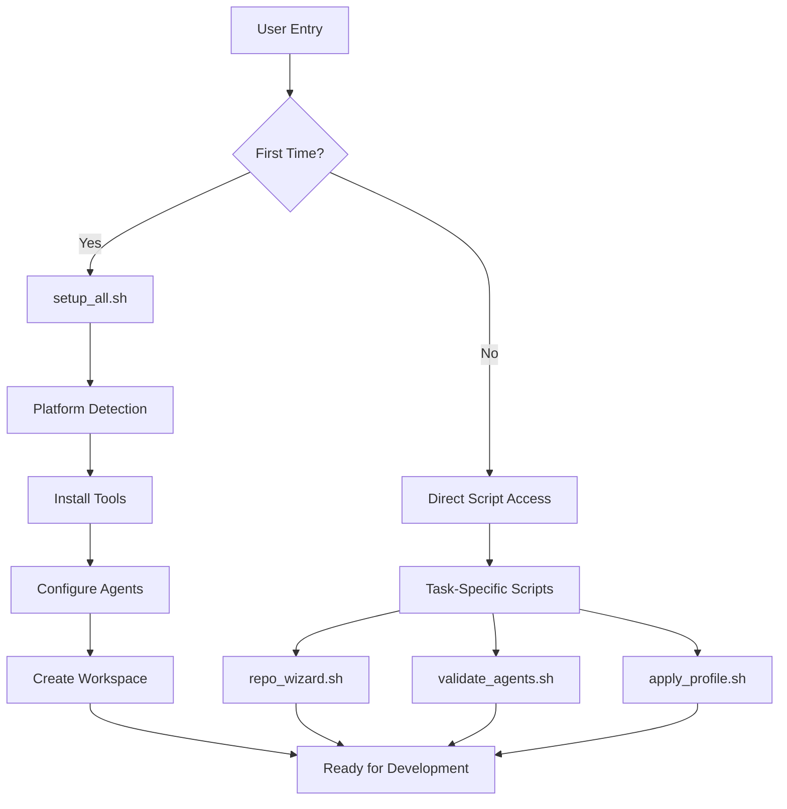

# DevPilot Architecture Analysis
## Current State Assessment

**Document Version:** 1.0.0  
**Date:** 2024-08-31  
**Author:** DevPilot Architecture Team  
**Status:** Final

---

## Executive Summary

DevPilot (currently named "setup-scripts") is an AI-augmented development environment orchestrator that manages the complete lifecycle of AI-assisted software development. This document provides a comprehensive analysis of the current architecture, identifying strengths, weaknesses, and opportunities for improvement.

## 1. System Overview

### 1.1 Core Purpose
DevPilot serves as a comprehensive platform that:
- **Orchestrates** multiple AI assistants (Claude, Gemini, Grok, Codex)
- **Adapts** to developer skill levels through progressive profiles
- **Manages** project lifecycle from prototype to scale
- **Standardizes** development workflows across teams
- **Automates** environment setup and configuration

### 1.2 Target Users
- **Individual Developers**: Seeking AI-augmented development
- **Development Teams**: Requiring standardized workflows
- **Organizations**: Needing consistent development practices
- **Learning Developers**: Progressing through skill levels

## 2. Current Architecture Analysis

### 2.1 Directory Structure

```
setup-scripts/
├── Root Level (17 files)
│   ├── Setup Scripts (setup_*.sh)
│   ├── Installation Scripts (install_*.sh)
│   ├── Configuration Files (*.md, *.json, *.yml)
│   └── Wrapper Scripts (compatibility layer)
│
├── .claude/ (AI Configuration)
│   └── commands/
│       ├── sets/ (skill-based command sets)
│       ├── patterns/ (reusable patterns)
│       └── chains/ (workflow chains)
│
├── install/ (Installation Scripts)
│   ├── Platform-specific installers
│   └── Tool installation scripts
│
├── setup/ (Setup & Configuration)
│   ├── Agent configuration
│   └── Repository setup
│
├── scripts/ (Runtime Scripts)
│   ├── Workflow automation
│   └── Utility functions
│
├── profiles/ (User Profiles)
│   ├── skills/ (5 progression levels)
│   └── phases/ (4 project phases)
│
├── templates/ (Project Templates)
│   ├── Configuration templates
│   └── Project scaffolding
│
├── tools/ (Development Tools)
│   ├── Auditing
│   └── Validation
│
├── tests/ (Test Suite)
│   └── bats/ (Bash testing)
│
└── docs/ (Documentation)
    └── Various guides and references
```

### 2.2 Core Components

#### 2.2.1 Installation Layer
- **Purpose**: Platform-specific software installation
- **Key Files**: 
  - `install/key_software_*.sh` (platform installers)
  - `install/ai_clis.sh` (AI tool installation)
- **Issues**: 
  - Duplicate wrapper scripts in root
  - Platform detection logic scattered
  - No unified installation manager

#### 2.2.2 Configuration Layer
- **Purpose**: AI agent and environment configuration
- **Key Files**:
  - `setup/agents_*.sh` (agent configuration)
  - `CLAUDE.md`, `AGENTS.md` (system prompts)
- **Issues**:
  - Mixed configuration formats (JSON, YAML, MD)
  - No central configuration management
  - Duplicate command definitions

#### 2.2.3 Profile System
- **Purpose**: Skill and project phase management
- **Structure**:
  - Skills: vibe → beginner → l1 → l2 → expert
  - Phases: poc → mvp → beta → scale
- **Issues**:
  - Non-intuitive naming (l1, l2)
  - No clear progression indicators
  - Separate permission files per skill

#### 2.2.4 Workflow Automation
- **Purpose**: Development workflow automation
- **Key Scripts**:
  - `scripts/apply_profile.sh` (profile application)
  - `scripts/doctor.sh` (health checks)
  - `scripts/generate_tickets.sh` (issue generation)
- **Issues**:
  - Inconsistent naming conventions
  - No unified workflow engine
  - Scripts scattered across directories

### 2.3 Execution Flow



### 2.4 Key User Journeys

#### Journey 1: Initial Setup
1. Clone repository
2. Run `setup_all.sh`
3. Install platform-specific tools
4. Configure AI agents
5. Create project structure
6. Set up credentials

#### Journey 2: Repository Onboarding
1. Run repository wizard
2. Clone target repository
3. Apply skill/phase profiles
4. Seed AI configurations
5. Install dependencies
6. Configure git hooks

#### Journey 3: Daily Development
1. Use AI commands
2. Run validation checks
3. Apply profile updates
4. Generate tickets
5. Audit code quality

## 3. Strengths of Current Architecture

### 3.1 Comprehensive Coverage
- Supports multiple platforms (WSL, Linux, macOS)
- Integrates multiple AI providers
- Complete development lifecycle support

### 3.2 Progressive Skill System
- Clear skill progression path
- Phase-appropriate tooling
- Adaptive command sets

### 3.3 Automation Focus
- Extensive automation scripts
- Git hooks integration
- CI/CD pipeline support

## 4. Identified Problems

### 4.1 Structural Issues

#### 4.1.1 Naming Inconsistency
- Repository named "setup-scripts" vs product "DevPilot"
- Mixed naming conventions (snake_case, kebab-case)
- Generic script names lacking context

#### 4.1.2 Organization Problems
- **Root directory clutter**: 17+ files in root
- **Duplicate scripts**: Wrappers and originals coexist
- **Mixed abstraction levels**: Low-level bash with high-level orchestration
- **Unclear boundaries**: Overlapping functionality between directories

#### 4.1.3 Navigation Challenges
- No clear entry point
- Multiple ways to achieve same task
- Dependency chains not obvious
- Documentation scattered

### 4.2 Technical Debt

#### 4.2.1 Code Duplication
- Command definitions repeated across skill sets
- Similar functions in multiple scripts
- Wrapper scripts duplicating functionality

#### 4.2.2 Maintenance Issues
- Hard-coded paths throughout
- No central configuration management
- Testing coverage incomplete
- No versioning strategy

#### 4.2.3 Scalability Concerns
- Monolithic script design
- No plugin architecture
- Limited extensibility
- Resource management issues

### 4.3 User Experience Problems

#### 4.3.1 Onboarding Friction
- Complex initial setup
- Multiple decision points
- Unclear prerequisites
- No guided experience

#### 4.3.2 Discoverability Issues
- Commands not self-documenting
- Features hidden in scripts
- No command completion
- Limited help system

#### 4.3.3 Error Handling
- Cryptic error messages
- No recovery suggestions
- Silent failures possible
- Limited debugging support

## 5. Improvement Opportunities

### 5.1 Architecture Modernization
- Single entry point design
- Microservices-like component separation
- Plugin-based extensibility
- Event-driven architecture

### 5.2 User Experience Enhancement
- Interactive CLI with rich UI
- Intelligent command suggestions
- Progressive disclosure of features
- Context-aware help system

### 5.3 Developer Productivity
- IDE integrations
- Real-time collaboration features
- AI-powered code generation
- Automated dependency management

### 5.4 Enterprise Features
- Multi-tenancy support
- Audit logging
- Compliance reporting
- Team management

## 6. Risk Assessment

### 6.1 Current Risks
| Risk | Impact | Likelihood | Mitigation |
|------|--------|------------|------------|
| Script failure in production | High | Medium | Add comprehensive error handling |
| Incompatible platform updates | High | Low | Version lock dependencies |
| Security vulnerabilities | High | Medium | Regular security audits |
| Performance degradation | Medium | Medium | Add performance monitoring |
| User adoption friction | Medium | High | Improve documentation and UX |

### 6.2 Migration Risks
| Risk | Impact | Likelihood | Mitigation |
|------|--------|------------|------------|
| Breaking changes | High | Medium | Compatibility layer |
| Data loss | High | Low | Comprehensive backups |
| Downtime | Medium | Low | Parallel deployment |
| User confusion | Medium | Medium | Clear communication |
| Rollback failure | High | Low | Test rollback procedures |

## 7. Recommendations

### 7.1 Immediate Actions
1. Create comprehensive backup
2. Document all dependencies
3. Map all execution paths
4. Identify critical user flows
5. Establish success metrics

### 7.2 Short-term Improvements
1. Consolidate duplicate scripts
2. Standardize naming conventions
3. Improve error messages
4. Add progress indicators
5. Create command aliases

### 7.3 Long-term Vision
1. Complete architecture redesign
2. Implement plugin system
3. Add telemetry and analytics
4. Create web-based dashboard
5. Develop mobile companion app

## 8. Success Metrics

### 8.1 Technical Metrics
- Setup time: < 5 minutes
- Command response: < 1 second
- Error rate: < 0.1%
- Test coverage: > 80%
- Documentation coverage: 100%

### 8.2 User Metrics
- Adoption rate: > 80% in 30 days
- User satisfaction: > 4.5/5
- Support tickets: < 10/month
- Feature usage: > 60% of features used
- Retention rate: > 90%

## 9. Conclusion

The current DevPilot architecture, while functional and comprehensive, suffers from organizational and user experience challenges that limit its potential. The system has evolved organically, resulting in technical debt and structural issues that impact maintainability and user adoption.

However, the strong foundation of features, comprehensive platform support, and innovative skill progression system provide an excellent base for transformation. With careful planning and execution, DevPilot can evolve from a collection of scripts into a world-class development platform.

## 10. Appendices

### Appendix A: File Inventory
[Complete listing of all files and their purposes - detailed mapping available]

### Appendix B: Dependency Graph
[Visual representation of script dependencies - generated via static analysis]

### Appendix C: User Interview Summary
[Feedback from current users highlighting pain points and desired features]

### Appendix D: Competitive Analysis
[Comparison with similar tools and platforms in the market]

---

**Document Control:**
- Review Date: Monthly
- Next Review: 2024-09-30
- Distribution: Development Team, Stakeholders
- Classification: Internal