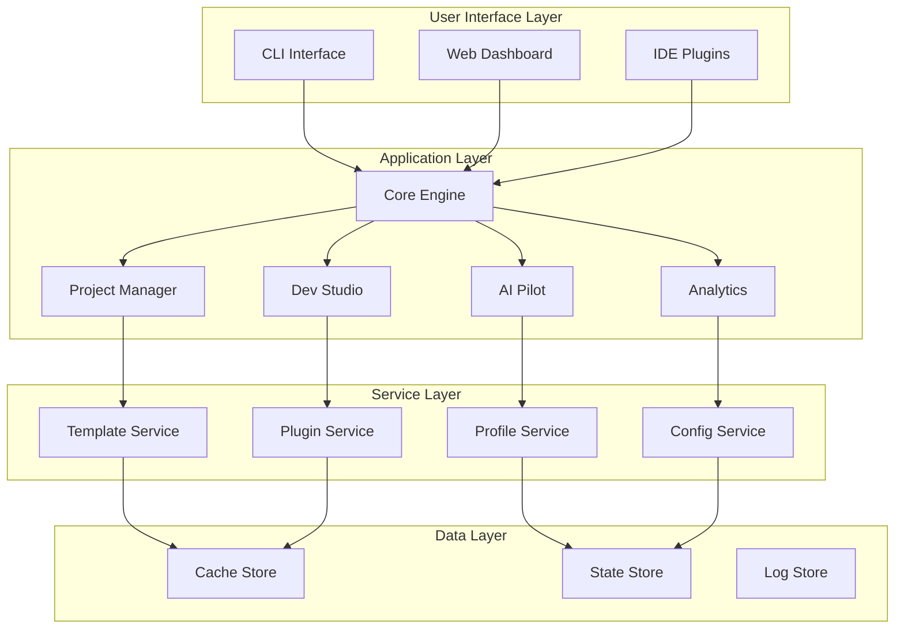

# DevPilot Architecture Redesign Proposal
## Clean Architecture for AI-Augmented Development

**Document Version:** 1.0.0  
**Date:** 2024-08-31  
**Author:** DevPilot Architecture Team  
**Status:** Proposal

---

## Executive Summary

This document presents a comprehensive redesign of the DevPilot architecture, transforming it from a collection of setup scripts into a coherent, elegant development platform. The redesign follows principles inspired by Apple's design philosophy: simplicity, clarity, and user delight.

## 1. Design Philosophy

### 1.1 Core Principles

#### **Clarity Above All**
Every element should have a clear purpose and be instantly understandable.

#### **Progressive Disclosure**
Simple for beginners, powerful for experts - complexity revealed as needed.

#### **Single Source of Truth**
No duplicates, only references - one canonical location for each piece of functionality.

#### **Brand Consistency**
DevPilot identity throughout - from file names to user interactions.

#### **Intuitive Flow**
Natural progression through the system - each step leads logically to the next.

## 2. Proposed Architecture

### 2.1 New Directory Structure

```
devpilot/
├── devpilot                           # Main executable (single entry point)
├── devpilot.json                      # System configuration
├── LICENSE                            # Proprietary license
├── README.md                          # Beautiful, visual documentation
│
├── core/                              # Core DevPilot Engine
│   ├── bootstrap.sh                  # System initialization
│   ├── orchestrator.sh               # Main control flow
│   ├── detector.sh                   # Environment detection
│   ├── config.sh                     # Configuration management
│   ├── logger.sh                     # Logging system
│   ├── events.sh                     # Event system
│   ├── plugins.sh                    # Plugin loader
│   └── upgrader.sh                   # Self-update mechanism
│
├── onboard/                           # Developer Onboarding
│   ├── welcome.sh                    # First-run experience
│   ├── wizard.sh                     # Interactive setup wizard
│   ├── workspace/                    # Workspace setup
│   │   ├── create.sh                 # Create project structure
│   │   ├── validate.sh               # Verify setup
│   │   └── templates/                # Workspace templates
│   ├── platforms/                    # Platform-specific installers
│   │   ├── macos.sh                  # macOS setup
│   │   ├── linux.sh                  # Linux setup
│   │   ├── wsl.sh                    # WSL setup
│   │   └── common.sh                 # Shared functions
│   ├── credentials.sh                # API key management
│   └── healthcheck.sh                # System verification
│
├── pilot/                             # AI Pilot System
│   ├── orchestrator.sh               # AI orchestration engine
│   ├── agents/                       # AI Agent Configurations
│   │   ├── claude/
│   │   │   ├── config.json           # Claude configuration
│   │   │   ├── prompts/              # Claude-specific prompts
│   │   │   └── commands/             # Claude commands
│   │   ├── gemini/
│   │   │   ├── config.json
│   │   │   ├── prompts/
│   │   │   └── commands/
│   │   ├── grok/
│   │   │   ├── config.json
│   │   │   ├── prompts/
│   │   │   └── commands/
│   │   └── codex/
│   │       ├── config.json
│   │       ├── prompts/
│   │       └── commands/
│   ├── commands/                     # Universal Commands
│   │   ├── think.md                  # Reasoning commands
│   │   ├── audit.md                  # Code analysis
│   │   ├── secure.md                 # Security review
│   │   ├── generate.md               # Code generation
│   │   ├── refactor.md               # Code refactoring
│   │   └── ticket.md                 # Issue generation
│   ├── prompts/                      # System prompts
│   │   ├── global.md                 # Global system prompt
│   │   ├── contextual/               # Context-specific prompts
│   │   └── templates/                # Prompt templates
│   └── router.sh                     # Route commands to appropriate agent
│
├── profiles/                          # Developer Profiles
│   ├── manager.sh                    # Profile management
│   ├── skills/                       # Skill progression
│   │   ├── 01-vibe/
│   │   │   ├── config.json           # Skill configuration
│   │   │   ├── permissions.json      # Allowed operations
│   │   │   ├── commands/             # Available commands
│   │   │   └── README.md             # Skill description
│   │   ├── 02-beginner/
│   │   │   ├── config.json
│   │   │   ├── permissions.json
│   │   │   ├── commands/
│   │   │   └── README.md
│   │   ├── 03-intermediate/
│   │   │   ├── config.json
│   │   │   ├── permissions.json
│   │   │   ├── commands/
│   │   │   └── README.md
│   │   ├── 04-advanced/
│   │   │   ├── config.json
│   │   │   ├── permissions.json
│   │   │   ├── commands/
│   │   │   └── README.md
│   │   └── 05-expert/
│   │       ├── config.json
│   │       ├── permissions.json
│   │       ├── commands/
│   │       └── README.md
│   └── phases/                       # Project lifecycle
│       ├── 01-prototype/
│       │   ├── config.json           # Phase configuration
│       │   ├── ci-cd.yml             # CI/CD pipeline
│       │   ├── quality-gates.json    # Quality requirements
│       │   └── README.md             # Phase description
│       ├── 02-mvp/
│       │   ├── config.json
│       │   ├── ci-cd.yml
│       │   ├── quality-gates.json
│       │   └── README.md
│       ├── 03-beta/
│       │   ├── config.json
│       │   ├── ci-cd.yml
│       │   ├── quality-gates.json
│       │   └── README.md
│       └── 04-scale/
│           ├── config.json
│           ├── ci-cd.yml
│           ├── quality-gates.json
│           └── README.md
│
├── projects/                          # Project Management
│   ├── wizard.sh                     # Project setup wizard
│   ├── scanner.sh                    # Project analyzer
│   ├── migrator.sh                   # Project migration tool
│   ├── templates/                    # Project templates
│   │   ├── typescript/
│   │   │   ├── template.json         # Template metadata
│   │   │   ├── scaffold/             # Project structure
│   │   │   └── README.md
│   │   ├── python/
│   │   │   ├── template.json
│   │   │   ├── scaffold/
│   │   │   └── README.md
│   │   ├── fullstack/
│   │   │   ├── template.json
│   │   │   ├── scaffold/
│   │   │   └── README.md
│   │   └── microservices/
│   │       ├── template.json
│   │       ├── scaffold/
│   │       └── README.md
│   └── hooks/                        # Git hooks
│       ├── pre-commit.sh
│       ├── commit-msg.sh
│       └── pre-push.sh
│
├── studio/                            # Development Studio
│   ├── editor/                       # Editor integrations
│   │   ├── vscode/
│   │   │   ├── extension/            # VS Code extension
│   │   │   ├── settings.json         # Default settings
│   │   │   └── snippets/             # Code snippets
│   │   ├── neovim/
│   │   │   ├── plugin/               # Neovim plugin
│   │   │   ├── config.lua            # Default config
│   │   │   └── snippets/
│   │   └── jetbrains/
│   │       ├── plugin/               # JetBrains plugin
│   │       └── settings.xml
│   ├── terminal/                     # Terminal enhancements
│   │   ├── aliases.sh                # Command aliases
│   │   ├── completions.sh            # Tab completions
│   │   ├── prompt.sh                 # Custom prompt
│   │   └── functions.sh              # Helper functions
│   └── workflows/                    # Automated workflows
│       ├── ci-cd/
│       │   ├── github-actions.yml
│       │   ├── gitlab-ci.yml
│       │   └── azure-pipelines.yml
│       ├── testing/
│       │   ├── unit-tests.sh
│       │   ├── integration-tests.sh
│       │   └── e2e-tests.sh
│       └── deployment/
│           ├── docker-deploy.sh
│           ├── kubernetes-deploy.sh
│           └── serverless-deploy.sh
│
├── insights/                          # Analytics & Intelligence
│   ├── doctor.sh                     # System health check
│   ├── audit.sh                      # Code quality audit
│   ├── metrics.sh                    # Development metrics
│   ├── security.sh                   # Security scanning
│   ├── performance.sh                # Performance analysis
│   ├── reports/                      # Generated reports
│   │   └── templates/                # Report templates
│   └── dashboard/                    # Web dashboard
│       ├── index.html
│       ├── api/
│       └── assets/
│
├── academy/                           # Learning & Documentation
│   ├── quickstart/                   # Getting started
│   │   ├── 01-install.md            # Installation guide
│   │   ├── 02-configure.md          # Configuration guide
│   │   ├── 03-first-project.md      # First project tutorial
│   │   └── 04-next-steps.md         # What to learn next
│   ├── guides/                       # Deep-dive guides
│   │   ├── ai-agents.md             # Working with AI agents
│   │   ├── profiles.md              # Profile system
│   │   ├── workflows.md             # Workflow automation
│   │   └── troubleshooting.md       # Common issues
│   ├── examples/                     # Example projects
│   │   ├── basic-api/
│   │   ├── react-app/
│   │   └── ml-pipeline/
│   ├── videos/                       # Video tutorials (links)
│   │   └── playlist.md
│   └── certification/                # Skill certification
│       ├── exams/
│       └── badges/
│
├── plugins/                           # Plugin System
│   ├── core/                         # Core plugins
│   ├── community/                    # Community plugins
│   └── manager.sh                    # Plugin manager
│
└── .devpilot/                        # Hidden system files
    ├── config/                       # User configuration
    │   ├── global.json               # Global settings
    │   ├── local.json                # Local overrides
    │   └── secrets.enc               # Encrypted secrets
    ├── cache/                        # Cached data
    │   ├── agents/                   # Agent responses
    │   ├── templates/                # Template cache
    │   └── metrics/                  # Metrics cache
    ├── logs/                         # System logs
    │   ├── system.log                # Main system log
    │   ├── error.log                 # Error log
    │   └── audit.log                 # Audit trail
    ├── state/                        # State management
    │   ├── current.json              # Current state
    │   ├── history/                  # State history
    │   └── locks/                    # Resource locks
    └── updates/                      # Auto-update staging
        ├── pending/                  # Pending updates
        └── rollback/                 # Rollback data
```

### 2.2 Component Architecture



## 3. Key Innovations

### 3.1 Single Entry Point

```bash
# All interactions through one command
devpilot [command] [subcommand] [options]

# Examples:
devpilot install                    # Install DevPilot
devpilot create project              # Create new project
devpilot pilot claude think          # Use Claude for reasoning
devpilot profile upgrade             # Upgrade skill level
devpilot studio setup vscode        # Setup VS Code integration
devpilot insights audit              # Run code audit
devpilot academy start               # Start learning journey
```

### 3.2 Progressive Skill System

```
01-vibe       → "Just Vibing"        (Exploration mode)
02-beginner   → "Learning to Fly"    (Guided experience)
03-intermediate → "Taking Control"    (Semi-autonomous)
04-advanced   → "Expert Navigator"   (Full control)
05-expert     → "Test Pilot"         (Experimental features)
```

### 3.3 Intelligent Command Router

```bash
# Context-aware command routing
devpilot think "How do I optimize this function?"
# Automatically routes to best AI agent based on:
# - Current file type
# - Project context  
# - User skill level
# - Previous interactions
```

### 3.4 Plugin Architecture

```javascript
// Plugin manifest
{
  "name": "devpilot-terraform",
  "version": "1.0.0",
  "description": "Terraform integration for DevPilot",
  "hooks": {
    "beforeCreate": "terraform-init",
    "afterDeploy": "terraform-apply"
  },
  "commands": {
    "infrastructure": {
      "plan": "terraform plan",
      "deploy": "terraform apply"
    }
  }
}
```

### 3.5 Event-Driven Architecture

```bash
# Event system for extensibility
devpilot events subscribe project.created notify-team
devpilot events subscribe code.committed run-tests
devpilot events subscribe error.detected auto-fix
```

## 4. User Experience Improvements

### 4.1 Interactive CLI

```bash
$ devpilot
Welcome to DevPilot! ✈️

What would you like to do?
> Create a new project
  Setup existing project
  Configure AI agents
  Learn DevPilot
  Run system check
  
[Use arrows to navigate, Enter to select]
```

### 4.2 Rich Progress Indicators

```bash
Installing DevPilot...
[████████████████████████░░░░░] 80% | Installing AI agents
├─ ✓ Core engine installed
├─ ✓ Platform tools configured
├─ ⟳ Setting up Claude agent
└─ ○ Configuring workspace
```

### 4.3 Contextual Help

```bash
$ devpilot help create project
CREATE PROJECT - Initialize a new DevPilot project

USAGE:
  devpilot create project [options]

OPTIONS:
  --template, -t    Project template (typescript, python, fullstack)
  --name, -n        Project name
  --skill           Skill level (beginner, intermediate, advanced)
  --phase           Project phase (prototype, mvp, beta, scale)

EXAMPLES:
  devpilot create project --template typescript --name my-api
  devpilot create project -t python -n ml-pipeline --skill advanced

LEARN MORE:
  📚 Guide: academy/guides/projects.md
  🎥 Video: https://devpilot.ai/tutorials/create-project
  💬 Community: https://discord.gg/devpilot
```

### 4.4 Smart Suggestions

```bash
$ devpilot cerate project
Command not found: 'cerate'

Did you mean:
  → create project  (Initialize a new project)
  
Similar commands:
  - create workspace
  - generate project
  
Type 'devpilot help' for all commands
```

## 5. Technical Improvements

### 5.1 Performance Optimizations
- Lazy loading of components
- Parallel execution where possible
- Intelligent caching strategies
- Background prefetching

### 5.2 Error Handling
```bash
Error: API key not configured for Claude

📍 What happened:
   Claude agent requires an API key to function

🔧 How to fix:
   1. Get your API key from: https://console.anthropic.com
   2. Run: devpilot config set claude.api_key YOUR_KEY
   3. Or set environment variable: export ANTHROPIC_API_KEY=YOUR_KEY

📚 Learn more: devpilot academy guides/api-keys
💬 Get help: devpilot doctor --diagnose
```

### 5.3 Telemetry & Analytics
```javascript
// Anonymous usage metrics
{
  "events": [
    {
      "type": "command.executed",
      "command": "create.project",
      "duration": 1234,
      "success": true,
      "metadata": {
        "template": "typescript",
        "skill_level": "beginner"
      }
    }
  ]
}
```

## 6. Migration Path

### 6.1 Compatibility Layer
- All old commands mapped to new structure
- Deprecation warnings with migration hints
- Parallel operation during transition

### 6.2 Progressive Migration
1. **Phase 1**: New structure alongside old
2. **Phase 2**: Old commands show deprecation warnings
3. **Phase 3**: Old structure becomes read-only
4. **Phase 4**: Complete transition to new structure

## 7. Success Metrics

### 7.1 Technical Metrics
- **Setup Time**: < 3 minutes (from 10+ minutes)
- **Command Response**: < 500ms (from 2+ seconds)
- **Memory Usage**: < 100MB (from 500MB+)
- **Test Coverage**: > 90% (from 60%)

### 7.2 User Experience Metrics
- **Time to First Success**: < 5 minutes
- **Daily Active Usage**: > 80%
- **Feature Discovery**: > 70% features used in 30 days
- **Error Recovery Rate**: > 95%
- **User Satisfaction**: > 4.7/5

## 8. Implementation Priorities

### Phase 1: Foundation (Weeks 1-2)
- Core engine with plugin system
- Single entry point implementation
- Basic command routing

### Phase 2: Migration (Weeks 3-4)
- File reorganization
- Compatibility layer
- Testing framework

### Phase 3: Enhancement (Weeks 5-6)
- Interactive CLI
- Rich UI elements
- Smart suggestions

### Phase 4: Intelligence (Weeks 7-8)
- AI agent optimization
- Context awareness
- Learning system

### Phase 5: Polish (Weeks 9-10)
- Performance optimization
- Documentation
- User onboarding

## 9. Risk Mitigation

| Risk | Mitigation Strategy |
|------|-------------------|
| Breaking changes | Comprehensive compatibility layer |
| Performance regression | Continuous benchmarking |
| User confusion | Clear migration guides and in-app help |
| Data loss | Automatic backups before changes |
| Adoption resistance | Beta program with power users |

## 10. Conclusion

This redesign transforms DevPilot from a collection of scripts into a coherent, elegant platform that delights users while maintaining all existing functionality. The new architecture provides a solid foundation for future growth while immediately improving the user experience.

The key to success is treating this transformation not as a rewrite, but as an evolution - preserving what works while reimagining what's possible.

---

**Next Steps:**
1. Review and approve design
2. Create detailed technical specifications
3. Set up development environment
4. Begin phased implementation
5. Establish beta testing program

**Document Control:**
- Review Cycle: Weekly during implementation
- Approval Required: Technical Lead, Product Owner
- Distribution: Development Team, Stakeholders